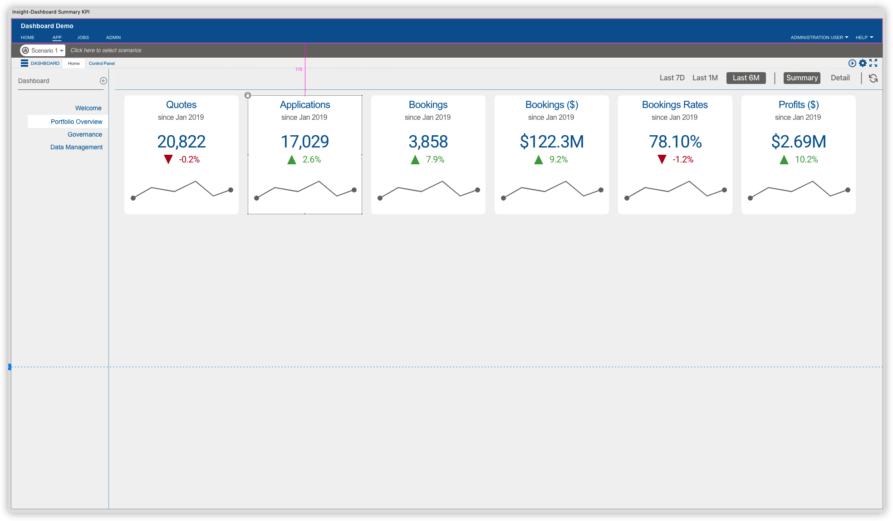
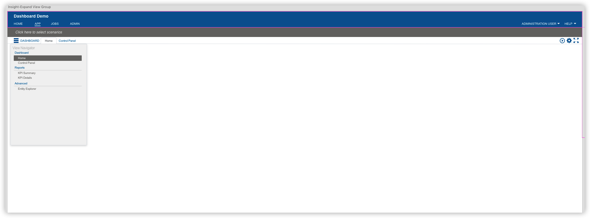

# insight-xpress-insight-wireframe

This repository included the XD template for FICO xpress insight, which contains a few reusable components specific to xpress insight applications:

1. Banner on the top contains App name, HOME/APP/JOBS/ADMIN tab and USERNAME/HELP dropdown button

2. Scenario Shelf (with or without scenario on shelf)

3. Tab menu and utility buttons

4. View Navigator

5. VDLx side-panel

6. VDLx toolbar

7. VDLx KPI summary tile

Examples:

